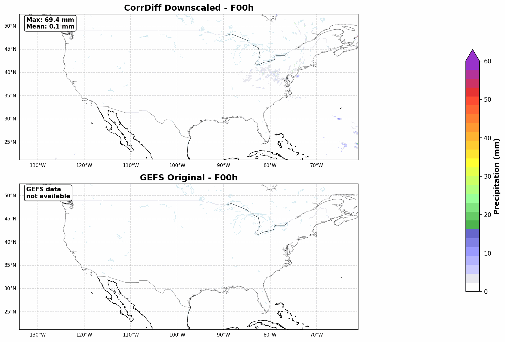

# CorrDiff: High-Resolution Weather Downscaling with NVIDIA Earth-2

A comprehensive toolkit for running NVIDIA's CorrDiff model for high-resolution weather downscaling, data preprocessing, visualization, and analysis.


*Animated comparison of CorrDiff downscaled precipitation (top) vs GEFS original (bottom) showing Hurricane Helene's precipitation evolution*

## 🌟 Features

- **Data Preprocessing**: Fetch and prepare GEFS forecast data for CorrDiff input
- **Model Inference**: Deploy and run CorrDiff model using Docker/Apptainer
- **Data Visualization**: Create publication-ready precipitation maps and animations
- **Comparative Analysis**: Side-by-side comparison of downscaled vs original forecasts
- **Batch Processing**: Automated workflow for multiple forecast hours

## 📋 Table of Contents

- [Installation](#installation)
- [Quick Start](#quick-start)
- [Core Scripts](#core-scripts)
- [Visualization Tools](#visualization-tools)
- [Model Deployment](#model-deployment)
- [Usage Examples](#usage-examples)
- [File Structure](#file-structure)
- [Contributing](#contributing)

## 🚀 Installation

### Prerequisites

- Python 3.12+
- NVIDIA NGC API key (for CorrDiff model access)
- Docker or Apptainer/Singularity

### Setup Environment

```bash
# Install UV package manager
sudo snap install astral-uv --classic

# Create project and install dependencies
mkdir earth2studio-project && cd earth2studio-project
uv init --python=3.12
uv add "earth2studio @ git+https://github.com/NVIDIA/earth2studio.git@0.6.0"

# Install additional dependencies
uv add matplotlib cartopy pillow scipy numpy
```

## 🏃 Quick Start

1. **Prepare Input Data**
```bash
python run_corrdiff.py
```

2. **Deploy CorrDiff Model** (see [Model Deployment](#model-deployment))

3. **Run Inference**
```bash
./run_inference.sh
```

4. **Create Visualization**
```bash
python plot_precipitation.py 000_000.npy --output rainfall_map.png
```

5. **Generate Animation**
```bash
python make_precip_gif_comparison.py --output forecast_evolution.gif
```

## 📝 Core Scripts

### `run_corrdiff.py`
**Purpose**: Fetch and preprocess GEFS forecast data for CorrDiff input

**Features**:
- Downloads GEFS forecast data from multiple pressure levels
- Crops data to specified geographic region (centered on Kerr County, Texas)
- Handles coordinate transformations and grid interpolation
- Generates model-ready input files for multiple forecast hours
- Supports both surface and pressure level variables

**Key Variables**:
- **Surface**: u10m, v10m, t2m, r2m, sp, msl, tcwv
- **Pressure levels**: u, v, z, t, r at 1000, 925, 850, 700, 500, 250 hPa

**Usage**:
```bash
python run_corrdiff.py
# Generates: corrdiff_inputs_f0.npy, corrdiff_inputs_f3.npy, ..., corrdiff_inputs_f24.npy
```

### `run_inference.sh`
**Purpose**: Automated batch inference using CorrDiff model

**Features**:
- Processes multiple forecast hours (0, 3, 6, 9, 12, 15, 18, 21, 24h)
- Handles tar file extraction and renaming
- Error checking and logging
- Configurable samples and steps parameters

**Usage**:
```bash
./run_inference.sh
# Processes all forecast hours automatically
```

## 🎨 Visualization Tools

### `plot_precipitation.py`
**Purpose**: Create individual precipitation maps from CorrDiff output

**Features**:
- NCAR-style precipitation colormap (0-100mm)
- Geographic projection with coastlines, borders, and state boundaries
- Automatic data denormalization using HRRR statistics
- Publication-ready output with statistics overlay
- Command-line interface with flexible options

**Usage**:
```bash
# Basic usage
python plot_precipitation.py 000_000.npy

# Advanced options
python plot_precipitation.py data.npy \
    --output custom_plot.png \
    --max-precip 80 \
    --title "24h Rainfall Forecast" \
    --no-show
```

**Arguments**:
- `input_file`: CorrDiff output file (.npy)
- `--output, -o`: Output file path (optional)
- `--max-precip, -m`: Maximum precipitation for colorbar (default: 60mm)
- `--title, -t`: Custom plot title
- `--no-show`: Don't display plot (useful for batch processing)

### `make_precip_gif.py`
**Purpose**: Create animated GIF from multiple forecast hours

**Features**:
- Automatic file discovery and sorting by forecast hour
- NCAR precipitation colormap with consistent scaling
- Geographic context with map features
- Customizable frame duration and figure size
- Statistics overlay for each frame

**Usage**:
```bash
# Basic animation
python make_precip_gif.py

# Custom options
python make_precip_gif.py \
    --output my_forecast.gif \
    --pattern "output/*_f*.npy" \
    --duration 0.5 \
    --max-precip 80
```

### `make_precip_gif_comparison.py`
**Purpose**: Create side-by-side comparison animation of CorrDiff vs GEFS

**Features**:
- Dual-panel layout (CorrDiff top, GEFS bottom)
- Automatic GEFS data retrieval and regridding
- Synchronized colormaps and scaling
- Temporal evolution analysis
- Statistical comparison overlay

**Usage**:
```bash
# Basic comparison
python make_precip_gif_comparison.py

# With custom base time
python make_precip_gif_comparison.py \
    --base-time "2024-09-27T12:00:00" \
    --output helene_comparison.gif \
    --duration 1.0
```

**Key Features**:
- Fetches corresponding GEFS precipitation data
- Interpolates GEFS to CorrDiff grid resolution
- Shows both absolute values and relative differences
- Includes correlation analysis between datasets

### `denormalize_data.py`
**Purpose**: Utility functions for data denormalization

**Features**:
- HRRR statistics loading and application
- Variable-specific denormalization
- Data range validation
- Support for estimated vs actual normalization parameters

## 🐳 Model Deployment

### Docker Deployment

```bash
# Login to NVIDIA Container Registry
docker login nvcr.io
# Username: $oauthtoken
# Password: YOUR_NGC_API_KEY

# Pull CorrDiff container
docker pull nvcr.io/nim/nvidia/corrdiff:1.0.0

# Run container
docker run --gpus all -p 8000:8000 \
    -e NGC_API_KEY=YOUR_NGC_API_KEY \
    nvcr.io/nim/nvidia/corrdiff:1.0.0
```

### Apptainer/Singularity Deployment

```bash
# Set credentials
export APPTAINER_DOCKER_USERNAME='$oauthtoken'
export APPTAINER_DOCKER_PASSWORD='YOUR_NGC_API_KEY'

# Login and pull
apptainer remote login -u '$oauthtoken' docker://nvcr.io
apptainer pull docker://nvcr.io/nim/nvidia/corrdiff:1.0.0

# Create scratch directory
mkdir -p /glade/derecho/scratch/li1995/tmp

# Run container
export NGC_API_KEY=YOUR_NGC_API_KEY
APPTAINERENV_NGC_API_KEY=$NGC_API_KEY apptainer run \
    --nv --writable-tmpfs \
    --bind /glade/derecho/scratch/li1995/tmp:/glade/derecho/scratch/li1995/tmp \
    corrdiff_1.0.0.sif
```

### Model Inference API

```bash
# Single forecast hour
curl -X POST \
    -F "input_array=@corrdiff_inputs_f0.npy" \
    -F "samples=2" \
    -F "steps=12" \
    -o output_f0.tar \
    http://localhost:8000/v1/infer
```

## 💡 Usage Examples

### Hurricane Case Study
```bash
# 1. Prepare data for Hurricane Helene (Sept 27, 2024)
python run_corrdiff.py

# 2. Run inference for all forecast hours
./run_inference.sh

# 3. Create comparison animation
python make_precip_gif_comparison.py \
    --base-time "2024-09-27T12:00:00" \
    --output helene_comparison.gif \
    --max-precip 60

# 4. Generate individual high-quality plots
for file in output/*.npy; do
    python plot_precipitation.py "$file" \
        --output "plots/$(basename $file .npy).png" \
        --max-precip 60
done
```

### Batch Processing Workflow
```bash
# Process multiple initialization times
for init_time in "2024-09-26T12:00:00" "2024-09-27T00:00:00" "2024-09-27T12:00:00"; do
    echo "Processing $init_time"
    
    # Update initialization time in script
    sed -i "s/datetime(.*)/datetime.fromisoformat('$init_time')/" run_corrdiff.py
    
    # Generate input data
    python run_corrdiff.py
    
    # Run inference
    ./run_inference.sh
    
    # Create visualization
    python make_precip_gif_comparison.py \
        --base-time "$init_time" \
        --output "animations/forecast_$init_time.gif"
done
```

## 📁 File Structure

```
earth2studio-project/
├── README.md                          # This file
├── .gitignore                         # Git ignore patterns
├── main.py                           # Entry point script
├── run_corrdiff.py                   # Data preprocessing
├── run_inference.sh                  # Batch inference script
├── plot_precipitation.py             # Single frame visualization
├── make_precip_gif.py               # Animation creation
├── make_precip_gif_comparison.py    # Comparison animation
├── denormalize_data.py              # Utility functions
├── example.py                       # Usage examples
├── static/                          # Coordinate grids and statistics
│   ├── corrdiff_output_lat.npy     # Latitude coordinates
│   ├── corrdiff_output_lon.npy     # Longitude coordinates
│   ├── corrdiff_us_hrrr_means.npy  # HRRR normalization means
│   └── corrdiff_us_hrrr_stds.npy   # HRRR normalization stds
├── input/                           # Generated input files (*.npy)
├── output/                          # Model output files (*.npy)
└── animations/                      # Generated GIF animations
```

## 🔧 Configuration

### Key Parameters

**Geographic Domain**:
- Centered on Kerr County, Texas (30.04°N, 99.20°W)
- Grid dimensions: 129 × 301 (input), 1056 × 1792 (output)
- Resolution: 0.25° (input), ~3km (output)

**Forecast Configuration**:
- Forecast hours: 0, 3, 6, 9, 12, 15, 18, 21, 24
- Variables: 8 output variables (u10m, v10m, t2m, tp, csnow, cicep, cfrzr, crain)
- Ensemble members: Configurable (default: 2 samples)

**Visualization Settings**:
- Colormap: NCAR precipitation scale (0-60mm default)
- Projection: PlateCarree (geographic)
- Features: Coastlines, borders, states, lakes, rivers

## 📊 Output Data

### CorrDiff Output Variables
1. **u10m**: 10-meter u-wind component (m/s)
2. **v10m**: 10-meter v-wind component (m/s)
3. **t2m**: 2-meter temperature (K)
4. **tp**: Total precipitation (m, converted to mm in visualization)
5. **csnow**: Snow fraction (0-1)
6. **cicep**: Ice pellet fraction (0-1)
7. **cfrzr**: Freezing rain fraction (0-1)
8. **crain**: Rain fraction (0-1)

### File Naming Convention
- Input files: `corrdiff_inputs_f{hour}.npy`
- Output files: `{sample}_{realization}_f{hour}.npy` or `{sample}_{realization}.npy`
- Visualizations: `precipitation_forecast.gif`, `precipitation_comparison.gif`

## 🔬 Technical Details

### Data Processing Pipeline
1. **GEFS Data Retrieval**: Download ensemble forecast data
2. **Coordinate Transformation**: Convert to model grid
3. **Variable Concatenation**: Combine surface + pressure level data
4. **Lead Time Encoding**: Add forecast hour as model input
5. **Normalization**: Apply GEFS statistics (input) / HRRR statistics (output)

### Model Specifications
- **Architecture**: Diffusion-based downscaling model
- **Input Resolution**: 0.25° (~25km)
- **Output Resolution**: ~3km
- **Domain**: Continental United States focus
- **Training Data**: GEFS (input) paired with HRRR (target)

### Performance Optimization
- Parallel processing for multiple forecast hours
- Efficient data loading with caching
- GPU acceleration for model inference
- Memory-efficient visualization rendering

## 📚 Resources

- **Model Documentation**: [NVIDIA NGC Catalog](https://catalog.ngc.nvidia.com/orgs/nim/teams/nvidia/models/earth2-corrdiff-us-gefs-hrrr)
- **Earth2Studio**: [GitHub Repository](https://github.com/NVIDIA/earth2studio)
- **CorrDiff Paper**: [arXiv:2309.15214](https://arxiv.org/abs/2309.15214)

## 🤝 Contributing

1. Fork the repository
2. Create a feature branch (`git checkout -b feature/amazing-feature`)
3. Commit your changes (`git commit -m 'Add amazing feature'`)
4. Push to the branch (`git push origin feature/amazing-feature`)
5. Open a Pull Request

## 📄 License

This project is licensed under the MIT License - see the LICENSE file for details.

## 🙏 Acknowledgments

- NVIDIA Earth-2 team for the CorrDiff model
- NOAA for GEFS and HRRR datasets
- NCAR for visualization tools and colormaps

---

**Note**: This toolkit requires access to NVIDIA's CorrDiff model through NGC. Ensure you have the appropriate licenses and API keys before use.